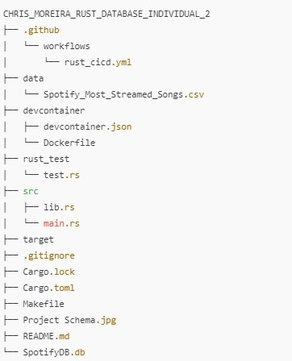
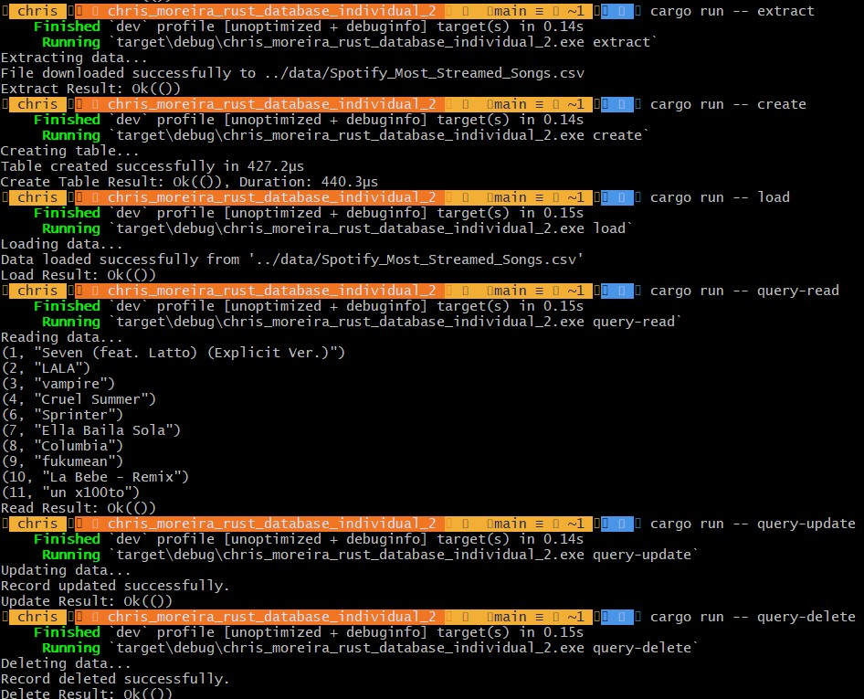

[](https://github.com/nogibjj/chris_moreira_rust_database_individual_2/actions/workflows/rust_cicd.yml)

# Project: Making a SQL Database with Rust

# Youtube Link
https://youtu.be/Y9Aa9_FOEVE

# File Structure


# Project Purpose
This project explores the performance of Rust in handling data extraction, transformation, and database operations using SQLite. The dataset, sourced from GitHub, is processed in Rust to create and populate a SQLite database, where CRUD (Create, Read, Update, Delete) operations are performed. The aim is to evaluate Rust's efficiency and suitability for data-heavy applications, particularly when handling structured datasets in a database. By focusing solely on Rust, this project demonstrates how it can effectively replace traditional scripting languages for data processing and database management, leveraging its efficiency features and building a command line.

Some operations we run with rust to sucessfully complete the project
```bash

#Build the project
cargo build

# Run the project
cargo run

# Make A new project
cargo new __project_name__

#Checking Dependencies
cargo check

#Adding Dependencies
cargo add dependency --features dependency_feature
cargo add dependency

#Checking for Linting Errors and Formatting
cargo clippy -- -D warnings
cargo fmt
cargo fmt -- --check

```
# Use of LLM
- I extensively used Chat GPT in this project to convert my source code from python(used in a previous project) into rust. 
- The LLMs helped de-bug errors and assure I was running the correct bash syntax to make rust operate adequately. 
- ChatGPT was also incredibly helpful when debugging my commit errors to Github(formatting and Linting). 

# CLI Run Examples
```bash
cargo run -- extract
cargo run -- create
cargo run -- load
cargo run -- query_read
cargo run -- query_update
cargo run -- query_delete
```

CLI commands running with sucessful outputs 



# Data Flow Schema

